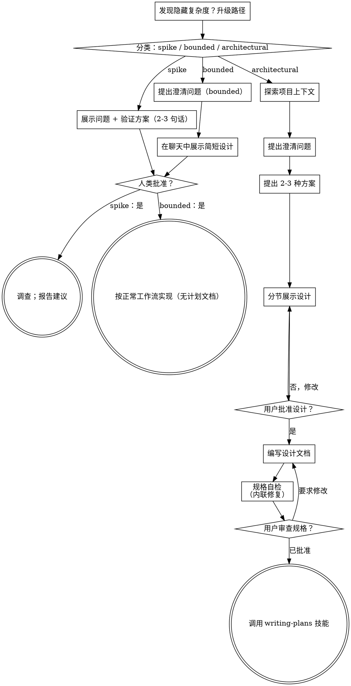

# 从想法头脑风暴到设计

通过自然、协作式的对话，帮助把想法转化为完整的设计和规格说明。

首先判断这个请求需要多重的流程，然后沿相应路径推进：理解上下文、细化想法、展示设计，并获得你的人类伙伴批准。

<HARD-GATE>
在你已经告诉人类伙伴你打算做什么、并且他们明确批准之前，**不要**调用任何实现技能、编写任何代码、搭建任何项目，或采取任何实现行动。这个规则适用于下方每一条路径中的**每一个任务**——流程仪式可以随任务规模缩放；批准关卡永远不能缩减。
</HARD-GATE>

## 三条路径

在提出第一个问题之前，先对请求分类，并把分类明确说出来——例如“这看起来是一个边界明确的小改动，所以我会在这里给出简短设计，而不是写正式规格”——这样你的人类伙伴可以纠正你的判断：

- **Spike（探索验证）** —— 可行性问题（“能不能……”“是否可能……”“先快速粗糙验证也行”），其产出是答案，而不是要保留的代码。用 2–3 句话说明问题和你准备怎样验证，获得认可后，以不牺牲正确性的最低成本查明结果。不写设计文档，不写规格文件。最终把发现作为建议报告；验证过程中构建的任何东西都必须明确标记为一次性产物。
- **Bounded（边界明确）** —— 对本仓库中**已经存在**的代码流程进行范围明确的改动：例如新增一个 flag、一个小 endpoint、一个单文件修复。知道这是哪类应用并不足以算 bounded——bounded 的含义是：你要修改的现有流程已经存在于仓库中，可以直接阅读。如果没有现有流程可改，这个任务就不是 bounded。提出真正重要的澄清问题，然后在**聊天中**展示一个简短设计（几句话到几个短段落），接着**停止**。只有人类伙伴明确同意这个设计后才能开始实现——bounded 任务的批准关卡和架构级任务一样严格。不写规格文件，也不写实现计划文档。
- **Architectural（架构级）** —— 新项目、新子系统、重构组件之间关系的变更，或会修改其他组件依赖接口的变更。执行完整流程：提问、比较方案、分节设计、书面规格，然后调用 writing-plans 技能。

如果你在两条路径之间拿不准，选择更重的一条。这个棘轮只能单向升级：如果任务执行到一半发现隐藏复杂度，就升级路径——停止当前工作，明确说明情况，然后进入更重的流程。任务中途绝不降级。

## 反模式：“太简单，不需要批准”

每一条路径都必须以人类伙伴批准你的意图后才能进入实现。待办事项列表、单函数工具、配置改动——设计也许只需要聊天里的两句话，但你**必须**展示并获得批准。“简单”任务恰恰最容易因未经检验的假设浪费大量工作。随简单程度缩放的是产物，而绝不是批准关卡。

## 危险信号

| 想法 | 事实 |
|---------|---------|
| “这太简单了，不需要设计” | 简单意味着设计更短，而不是没有设计。聊天里两句话，然后获得批准。 |
| “我把它叫 bounded，就可以跳过规格了” | 如果你是在找标签来跳过工作，这种犹豫本身就说明应走更重的路径。 |
| “这是 bounded，而且设计显而易见——他们看设计时我可以先开工” | 关卡是**批准**，不是设计长度。展示之后必须停止，直到听到明确同意。 |
| “我了解这种应用，所以它是 bounded” | Bounded 衡量的是仓库现状，不是你的熟悉程度。新项目没有可修改的现有流程——它属于 architectural。 |
| “Spike 验证成功了，所以代码可以直接留下” | Spike 的产出是答案。要保留代码就是一个新请求——重新分类。 |
| “任务变大了，但我都快做完了——没必要重新分类” | 隐藏复杂度会在中途升级路径。停止并说明情况。 |
| “他们已经批准 spike，所以后续改动也算批准了” | 每个任务都有自己的分类和自己的批准。 |

## 检查清单

先分类并宣布路径，然后为对应路径中的每一项创建任务，按顺序完成。

**Spike：**
1. **探索项目上下文** —— 足够用于界定验证问题即可
2. **展示问题 + 验证计划** —— 2–3 句话
3. **获得批准** —— 简单认可即可
4. **调查验证** —— 在不牺牲正确性的前提下尽可能低成本
5. **报告发现** —— 给出建议；把任何构建产物明确标记为一次性

**Bounded：**
1. **探索项目上下文** —— 检查文件、文档、最近提交
2. **提出澄清问题** —— 一次一个，只问真正重要的
3. **在聊天中展示简短设计** —— 方法、会修改的文件、测试方式
4. **获得批准** —— **停止**并等待明确的“是”；展示设计后马上开工，就是跳过关卡
5. **实现** —— 按正常开发工作流继续（TDD 仍然适用）；不写计划文档

**Architectural：**
1. **探索项目上下文** —— 检查文件、文档、最近提交
2. **恰到好处地提供视觉伴侣** —— **不要一开始就提供。** 第一次遇到“看图比文字描述明显更清楚”的问题时再单独提供；得到批准后，为用户打开浏览器标签页。如果全程没有真正的视觉问题，就永远不要提供。详见下方“视觉伴侣”。
3. **提出澄清问题** —— 一次一个，理解目的/约束/成功标准
4. **提出 2–3 种方案** —— 说明取舍并给出你的推荐
5. **展示设计** —— 按复杂度分节，并在每节后获得用户确认
6. **编写设计文档** —— 保存到 `docs/superpowers/specs/YYYY-MM-DD-<topic>-design.md` 并提交
7. **规格自检** —— 快速检查占位符、矛盾、歧义和范围（见下文）
8. **用户审查书面规格** —— 继续之前请用户审查规格文件
9. **过渡到实现** —— 调用 writing-plans 技能创建实现计划

## 流程图

**终止状态与路径绑定。** Architectural：brainstorming 之后**唯一**允许调用的技能是 writing-plans——不要调用 frontend-design、mcp-builder 或任何其他实现技能。Bounded：批准后直接通过正常开发工作流实现；不写计划文档。Spike：终止状态是报告建议。

## 流程详述

下面的子节服务于 bounded 和 architectural 两条路径（spike 在“展示验证方案，获得认可”之后进入调查即可）。从**探索方案**开始的章节属于 architectural 路径的深度——bounded 工作只需要上下文 + 少量问题 + 一份聊天中的简短设计。

**理解想法：**

- 首先查看当前项目状态（文件、文档、最近提交）
- 提出详细问题之前，先评估范围：如果请求描述多个独立子系统（例如“构建一个包含聊天、文件存储、计费和分析的平台”），立即指出。不要浪费问题去细化一个首先需要拆分的项目。
- 如果项目太大，一份规格无法覆盖，帮助用户拆成子项目：独立部分有哪些？它们如何关联？应该按什么顺序构建？然后让第一个子项目走正常设计流程。每个子项目都有自己的规格 → 计划 → 实现周期。
- 对范围合适的项目，一次提出一个问题来细化想法
- 能用多选问题时优先多选，但开放式问题也可以
- 每条消息只问一个问题——一个主题需要进一步探索时，拆成多个问题
- 聚焦理解：目的、约束、成功标准

**探索方案：**

- 提出 2–3 种不同方案并说明取舍
- 以对话方式展示选项，并给出你的推荐和理由
- 先给出你推荐的方案，再解释原因
- 严格执行 YAGNI——从每个方案和设计中删除不必要的功能

**展示设计：**

- 当你认为自己已经理解要构建什么时，展示设计
- 每节篇幅随复杂度缩放：简单内容几句话，复杂内容最多约 200–300 词
- 每一节之后询问当前是否正确
- 覆盖：架构、组件、数据流、错误处理、测试
- 如果有任何内容不合理，随时回头澄清

**为隔离性和清晰度而设计：**

- 把系统拆成更小的单元：每个单元只有一个明确目的，通过定义良好的接口通信，并可独立理解和测试
- 对每个单元，你都应该能回答：它做什么？怎么使用？依赖什么？
- 别人能否不读内部实现就理解这个单元？你能否在不破坏调用方的情况下修改内部实现？如果不能，边界需要调整。
- 更小、边界清晰的单元也更便于你工作——你对一次能完整放进上下文的代码推理得更好，文件越专注，编辑越可靠。文件不断变大通常说明它做了太多事情。

**在现有代码库中工作：**

- 提议变更之前先探索当前结构，遵循现有模式。
- 如果现有代码中有会影响当前工作的缺陷（例如文件太大、边界不清、职责纠缠），把有针对性的改善纳入设计——像优秀开发者一样改善自己正在接触的代码。
- 不要提出无关重构。只做服务于当前目标的事情。

## 设计之后（architectural 路径）

**文档：**

- 将确认后的设计（规格）写入 `docs/superpowers/specs/YYYY-MM-DD-<topic>-design.md`
  - （如果用户对规格位置有偏好，以用户偏好为准）
- 如果可用，使用 elements-of-style:writing-clearly-and-concisely 技能
- 将设计文档提交到 git

**规格自检：**
写完规格文档后，用全新的视角审视它：

1. **占位符扫描：** 是否还有 “TBD”“TODO”、未完成章节或含糊要求？修掉。
2. **内部一致性：** 是否有章节互相矛盾？架构是否与功能描述一致？
3. **范围检查：** 是否足够聚焦，可以由一份实现计划覆盖？还是需要继续拆分？
4. **歧义检查：** 某项要求是否可能有两种解释？如果有，选定一种并明确写清。

发现问题直接内联修复。无需再次审查——修正后继续。

**用户审查关卡：**
规格审查循环通过后，在继续之前请用户审查书面规格：

> “规格已编写并提交到 `<path>`。请审查一下；如果你希望在我们开始编写实现计划之前做任何修改，请告诉我。”

等待用户回复。如果他们要求修改，完成修改并重新运行规格自检。只有得到用户批准后才能继续。

**实现：**

- 调用 writing-plans 技能创建详细实现计划
- **不要**调用任何其他技能。下一步就是 writing-plans。

## 视觉伴侣

一种基于浏览器的伴侣工具，用于在头脑风暴中展示 mockup、图表和视觉选项。它是一个**工具**，不是一种模式。用户接受视觉伴侣，只意味着对于适合视觉呈现的问题可以使用它；并不意味着每个问题都要走浏览器。

**恰到好处地提供视觉伴侣：** 不要在一开始提供。等到某个问题真正“看图明显比文字描述更清楚”时——是真正的 mockup / 布局 / 图表问题，而不只是 UI **主题**——第一次出现这种情况时，再用单独一条消息提出：
> “接下来这一部分如果直接展示给你看可能更容易理解——我可以在浏览器标签页中边讨论边制作 mockup、图表和对比图。这个功能还比较新，可能会消耗较多 token。要试试吗？我会帮你打开。”

**这个提议必须单独占一条消息。** 只能写提议本身——不要附带澄清问题、摘要或其他内容。等待用户回复。如果他们接受，使用 `--open` 启动服务器，让浏览器自动打开到第一屏。如果他们拒绝，就继续纯文本，并且不要再次主动提供，除非用户自己重新提起。

**逐问题决策：** 即使用户已经接受，也要对**每一个问题**单独判断该用浏览器还是终端。判断标准：**用户看到它，会不会比读文字更容易理解？**

- **使用浏览器**：本质是视觉内容——mockup、线框图、布局比较、架构图、并排视觉设计
- **使用终端**：本质是文字内容——需求问题、概念选择、取舍列表、A/B/C/D 文字选项、范围决策

一个关于 UI 的问题并不自动等于视觉问题。“这里的 personality 是什么意思？”属于概念问题——用终端。“哪种向导布局更好？”才是视觉问题——用浏览器。

如果用户同意使用视觉伴侣，继续之前先阅读详细指南：
`skills/brainstorming/visual-companion.md`
