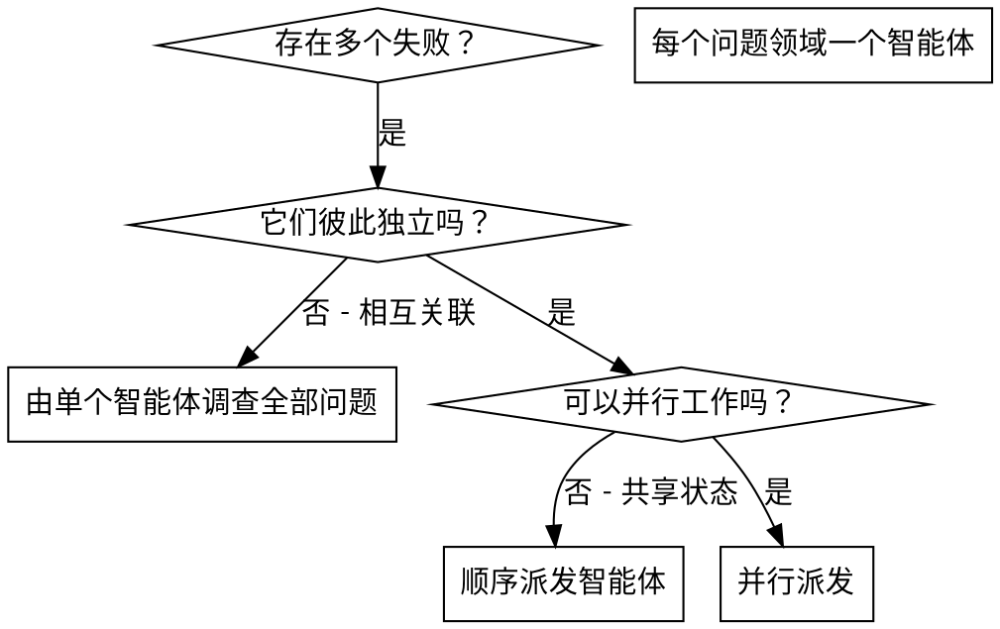

# 派发并行智能体

## 概述

你把任务委派给上下文隔离的专用智能体。通过精确构造它们的指令和上下文，可以确保它们保持专注并顺利完成任务。它们绝不应该继承你当前会话的上下文或历史——你只为它们构造恰好需要的内容。这样也能保留你自己的上下文，用于协调工作。

当存在多个彼此无关的失败（不同测试文件、不同子系统、不同 bug）时，按顺序逐个调查会浪费时间。每项调查彼此独立，可以并行进行。

**核心原则：** 每个独立问题领域派发一个智能体，让它们并发工作。

## 何时使用



**适合使用的情况：**
- 3 个以上测试文件失败，而且根因不同
- 多个子系统彼此独立地损坏
- 每个问题都可以在不依赖其他问题上下文的情况下理解
- 各调查之间没有共享状态

**不适合使用的情况：**
- 失败彼此相关（修复一个可能同时修复其他问题）
- 需要理解完整系统状态
- 智能体之间会互相干扰

## 模式

### 1. 识别独立领域

按故障内容对失败进行分组：
- 文件 A 的测试：工具审批流程
- 文件 B 的测试：批量完成行为
- 文件 C 的测试：中止功能

每个领域彼此独立——修复工具审批不会影响中止测试。

### 2. 创建聚焦的智能体任务

每个智能体获得：
- **明确范围：** 一个测试文件或子系统
- **清晰目标：** 让这些测试通过
- **约束：** 不要修改其他代码
- **预期输出：** 总结发现的问题和修复内容

### 3. 并行派发

在同一条回复中发出全部三个子智能体派发——它们会并行运行：

```text
Subagent (general-purpose): "Fix agent-tool-abort.test.ts failures"
Subagent (general-purpose): "Fix batch-completion-behavior.test.ts failures"
Subagent (general-purpose): "Fix tool-approval-race-conditions.test.ts failures"
# All three run concurrently.
```

一条回复中包含多个派发调用 = 并行执行。每条回复只派发一个 = 顺序执行。

### 4. 审查并集成

智能体返回后：
- 阅读每份总结
- 验证各修复不存在冲突
- 运行完整测试套件
- 集成所有改动

## 智能体提示词结构

好的智能体提示词应当：
1. **聚焦**——只包含一个清晰的问题领域
2. **自包含**——包含理解问题所需的全部上下文
3. **明确输出要求**——智能体应当返回什么？

```markdown
Fix the 3 failing tests in src/agents/agent-tool-abort.test.ts:

1. "should abort tool with partial output capture" - expects 'interrupted at' in message
2. "should handle mixed completed and aborted tools" - fast tool aborted instead of completed
3. "should properly track pendingToolCount" - expects 3 results but gets 0

These are timing/race condition issues. Your task:

1. Read the test file and understand what each test verifies
2. Identify root cause - timing issues or actual bugs?
3. Fix by:
   - Replacing arbitrary timeouts with event-based waiting
   - Fixing bugs in abort implementation if found
   - Adjusting test expectations if testing changed behavior

Do NOT just increase timeouts - find the real issue.

Return: Summary of what you found and what you fixed.
```

## 常见错误

**❌ 范围过大：** “修复所有测试”——智能体会迷失
**✅ 明确具体：** “修复 agent-tool-abort.test.ts”——范围聚焦

**❌ 没有上下文：** “修复这个竞态条件”——智能体不知道在哪里
**✅ 提供上下文：** 粘贴错误消息和测试名称

**❌ 没有约束：** 智能体可能重构所有内容
**✅ 给出约束：** “不要修改生产代码”或“只修测试”

**❌ 输出含糊：** “修好它”——你不知道改了什么
**✅ 明确具体：** “返回根因和改动摘要”

## 何时不要使用

**相关失败：** 修复一个可能修复其他问题——先一起调查
**需要完整上下文：** 必须看到整个系统才能理解
**探索性调试：** 你还不知道哪里坏了
**共享状态：** 智能体会互相干扰（编辑相同文件、使用相同资源）

## 真实会话示例

**场景：** 大规模重构后，3 个文件中出现 6 个测试失败

**失败：**
- agent-tool-abort.test.ts：3 个失败（时序问题）
- batch-completion-behavior.test.ts：2 个失败（工具没有执行）
- tool-approval-race-conditions.test.ts：1 个失败（执行次数 = 0）

**判断：** 独立领域——中止逻辑、批量完成和竞态条件彼此分离

**派发：**
```
Agent 1 → Fix agent-tool-abort.test.ts
Agent 2 → Fix batch-completion-behavior.test.ts
Agent 3 → Fix tool-approval-race-conditions.test.ts
```

**结果：**
- 智能体 1：用基于事件的等待替换 timeout
- 智能体 2：修复事件结构 bug（threadId 放错位置）
- 智能体 3：增加等待，确保异步工具执行完成

**集成：** 所有修复彼此独立、没有冲突，完整测试套件全部通过

## 验证

智能体返回后：
1. **审阅每份总结**——理解发生了什么变化
2. **检查冲突**——智能体是否编辑了相同代码？
3. **运行完整测试套件**——验证所有修复能一起工作
4. **抽查**——智能体可能产生系统性错误
