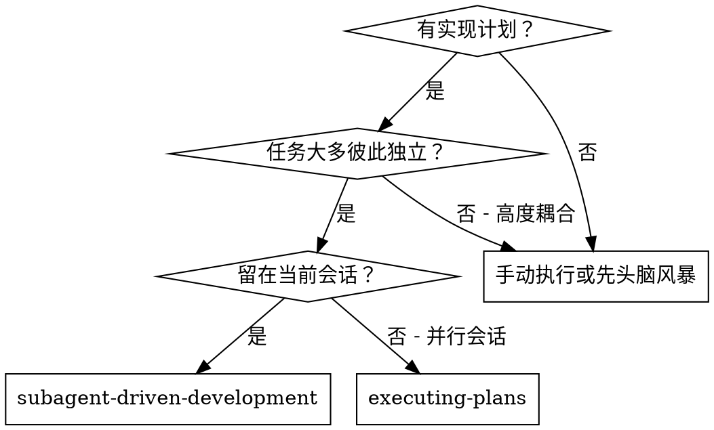
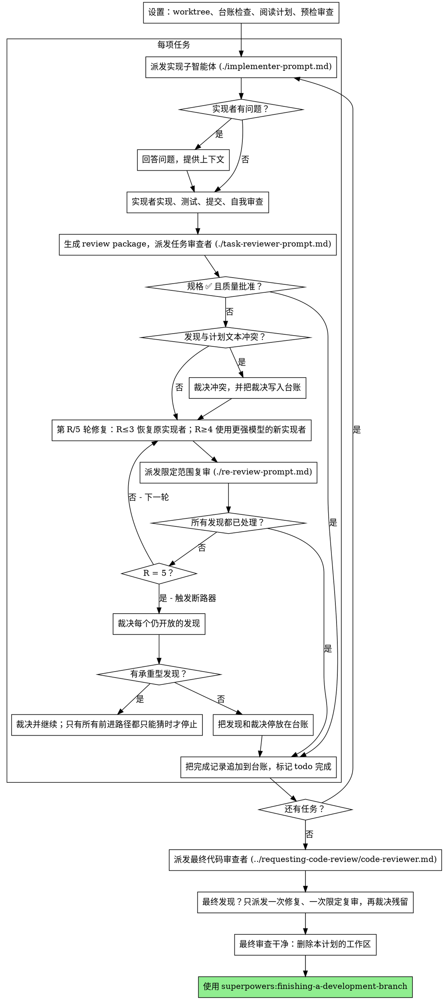

# 子智能体驱动开发

通过以下方式执行计划：每个任务派发一个全新的实现子智能体；每项任务完成后进行一次任务审查（规格符合性 + 代码质量）；全部任务结束后再进行一次广泛的整分支审查。

**为什么使用子智能体：** 你把任务委派给拥有隔离上下文的专用智能体。通过精确构造它们的指令和上下文，确保它们保持聚焦并完成任务。它们绝不应该继承你当前会话的上下文或历史——你只为它们构造恰好需要的内容。这样也能保留你自己的上下文，用于协调工作。

**核心原则：** 每个任务使用全新子智能体 + 每项任务审查（规格 + 质量）+ 最终广泛审查 = 高质量、快速迭代

**叙述：** 工具调用之间最多只说一行简短状态——台账和工具结果负责记录事实。

**连续执行：** 不要在任务之间停下来向你的人类伙伴确认。按照计划连续执行全部任务，不要停止。唯一允许停止的理由，是下方明确列出的四种情况，或全部任务已经完成。“要继续吗？”之类的提问和进度摘要只会浪费他们的时间——他们已经让你执行计划，所以执行它。

**做裁决，不要停摆。** 正在运行的计划不应等待人类。冲突、歧义、计划缺陷、原本你可能会请求突破的限制——自行做出决定。规格是具有约束力的权威，计划是规格的论证，而当二者都没有答案时，由你的判断作出裁决。把每个决定记录到台账中，格式为：
`Ruling: <你决定了什么> — <为什么> — <如果错了会付出什么代价>`，然后继续。错误裁决的代价是你的人类伙伴看得见、也能撤销的返工；因为一个问题把整个会话停一天，只会浪费时间，并不能换来更多价值。

只有四类事情会让你停下，而且**只有**这四类：不可逆或破坏性操作；安全敏感操作；工作树之外、按常规应当先征求同意的副作用（合并、推送到共享分支、发布）；以及计划已经坏到任何前进路径都只能靠猜。遇到这些情况，停止并询问。

## 何时使用



**与 Executing Plans（并行会话）相比：**
- 同一个会话（无需上下文切换）
- 每项任务使用全新子智能体（无上下文污染）
- 每项任务后进行审查（规格符合性 + 代码质量），结束时进行广泛审查
- 迭代更快（任务之间无需人类参与）

## 流程



## 设置

确保工作发生在隔离工作区中：使用 superpowers:using-git-worktrees 创建一个，或验证现有工作区。未经你的人类伙伴明确同意，绝不要在 main/master 分支上开始实现。

对话记忆无法跨过上下文压缩。在真实会话里，控制器一旦丢失进度位置，就曾重新派发整段已经完成的任务序列——这是观察到的最昂贵单一失败。把进度记录在**台账文件**中，而不只是 todo。

- 每份计划都拥有自己的工作区：技能开始时运行本技能的 `scripts/sdd-workspace PLAN_FILE`——它会打印该计划对应、被 git 忽略的目录（`<repo-root>/.superpowers/sdd/<plan-basename>/`），本计划的所有产物都放在那里：台账、brief、报告、review package。其他计划的目录永远不属于你，不要读也不要写。
- 检查本计划在 `<workspace>/progress.md` 中的台账。如果第一行写的是你的计划文件，则包含 `Task <N>: complete` 行的任务已经完成——**不要**重新派发；从第一个没有完成行的任务恢复。如果某任务最后一行是 fix round，说明正处于循环中：从下一轮恢复。如果台账第一行写的是另一个计划，或者旧的扁平路径 `.superpowers/sdd/progress.md` 中存在散落台账，那是别的计划进度：保留原样，为当前计划新建自己的台账。
- 创建台账时，第一行必须是身份信息：`# SDD ledger — plan: <plan file path>`。
- 台账是恢复地图：即使上下文已经忘记创建过哪些提交，台账里记录的提交仍存在于 git。发生压缩后，相信台账和 `git log`，不要相信自己的模糊记忆。
- `git clean -fdx` 会摧毁工作区（因为它是 git 忽略的 scratch）；如果发生这种情况，从 `git log` 恢复。

只阅读一次计划，记录其上下文和 Global Constraints，并为每项任务创建 todo。如果计划指定了 Spec，也阅读它：规格是计划论证所依据的权威，计划内部冲突要以规格为准。如果找不到可访问的规格，在台账中记录——没有规格支撑的裁决都是暂定的。

派发 Task 1 之前，先完整扫描一次计划中的冲突，并在检查时把内容写下来：

- 任务之间互相矛盾，或与计划 Global Constraints 冲突
- 计划明确要求做某件事，但审查 rubric 把它视为缺陷（例如没有任何断言的测试、逐字复制的逻辑块）

扫描结果必须是一张**表格**，不是一句结论。任何共享文件或接口的任务对都要有一行：两个任务分别是什么，一个产生什么、另一个消费什么，以及你发现了什么。每项任务也要有一行：任务自身文本是否自洽——指定的测试是否匹配指定代码、创建的文件是否与后续修改的文件一致。只写一句“扫描干净”而没有这些行，说明你根本没有真正执行扫描。

把表格写入台账。执行开始前，对所有发现进行裁决——每个发现都要对照强制它的计划文本——并将每个裁决记录在台账中。如果扫描干净，不必额外评论。对扫描发现的每个冲突进行裁决——规格是有约束力的权威，计划是它的论证——把裁决写在对应表格行旁边，然后派发 Task 1。之后的审查循环仍然作为兜底，用来发现只有实现后才暴露的冲突。

## 模型选择

为节省成本并提高速度，每个角色都使用**能够胜任它的最低档模型**。

**机械实现任务**（隔离函数、规格明确、1–2 个文件）：使用快速、廉价模型。当计划写得足够明确时，大多数实现任务都属于机械任务。

**集成和判断任务**（多文件协调、模式匹配、调试）：使用标准模型。

**架构和设计任务：** 使用可用的最强模型。最终整分支审查也属于这一类——使用可用最强模型派发，而不是会话默认模型。

**审查任务：** 根据 diff 大小、复杂度和风险选择具备相应判断力的模型。小型机械 diff 不需要最强模型；细微并发变更则需要。小修复 diff 的限定复审使用低到中档模型。

**修复循环升级（第 4–5 轮）：** 使用至少比卡住的实现者高一档的模型。

**派发子智能体时始终显式指定模型。** 如果省略，子智能体会继承你的会话模型——通常恰好是最强、最昂贵的模型——这会悄无声息地破坏本节的成本策略。

**回合数比 token 单价更重要。** 墙钟时间和上下文成本与子智能体需要多少回合直接相关，而最便宜的模型在多步骤工作中经常需要 2–3 倍回合，最终反而更贵。Reviewer 以及根据自然语言描述工作的 implementer，至少使用中档模型。当任务计划已经包含完整待写代码时，实现就只是抄写 + 测试：该 implementer 可以用最低档。单文件机械修复也用最低档。

**任务复杂度信号（实现任务）：**
- 修改 1–2 个文件，并有完整规格 → 廉价模型
- 修改多个文件且有集成问题 → 标准模型
- 需要设计判断或广泛理解代码库 → 最强模型

## 任务循环

**批量处理形状相同的小工作。** 如果计划中有多项任务，每一项都是同一种小型、独立编辑——例如相同的一行修复、常量修改、在多个文件重复添加字段——不要每项都派一个子智能体。创建**一个**派发简报，列出全部文件及对应改动，把整个批次交给一个子智能体，并把其 diff 作为一个整体审查。只有那些需要独立判断、独立测试或独立审查面的工作，才保留“一任务一派发”。

你粘进派发提示词的所有内容——以及子智能体打印回来的所有内容——都会在会话剩余时间里常驻你的上下文，并在之后每轮被重新读取。通过**文件**交接产物。

**等待已派发子智能体：** 绝不要用很短的 timeout 轮询 wait 接口，也不要陷入一次静默、无限期的等待。只要你还有本地工作——更新台账、打包下一份 review、阅读报告——就继续工作；子智能体结果会自己到达。只有真正无事可做时，才进行有界等待（平台允许时每段 5–10 分钟），并在每段等待之间输出一行状态，然后核对仍活跃的子智能体：列出它们，并追踪任何已完成却没有回报的子智能体。有界长等待几乎保留了长等待的全部效率，同时保证卡住或丢失的子智能体会在几分钟内被发现，而不是直到会话结束。

### 1. 派发实现者

派发之前记录 BASE（`git rev-parse HEAD`）——review package 和修复轮次 diff 都需要它。

- **任务 brief：** 派发 implementer 之前，运行本技能的 `scripts/task-brief PLAN_FILE N`——它会把该任务的完整文本提取到一个唯一命名文件，并打印路径。构造派发时，让 brief 始终是需求的唯一事实来源。派发内容应包含：（1）一句话说明该任务在项目中的位置；（2）brief 路径，并明确说“先读这个——它就是你的需求，其中精确值必须逐字使用”；（3）brief 无法知道、来自先前任务的接口和决定；（4）你对 brief 中任何歧义的裁决；（5）报告文件路径和报告契约。精确值（数字、magic string、签名、测试用例）只出现在 brief 中。绝不要让子智能体阅读整个计划文件。
- **报告文件：** 报告文件名称应与 brief 对应（brief `…/task-N-brief.md` → report `…/task-N-report.md`），并在派发提示词中写明。实现者把完整报告写在那里，只返回状态、提交、一行测试摘要和担忧。
- 一份派发提示词只描述一个任务，不描述整个会话历史。不要把不断累积的先前任务摘要（“Tasks 1–3 之后的状态”）粘进后续派发——真实会话中曾出现 42k 字符的派发，其中 99% 都只是重复历史。全新子智能体只需要当前任务、它会触碰的接口和全局约束，其他什么都不需要。
- 派发包含“不可再派子智能体”契约（已写在 implementer 模板中）：实现者绝不派 helper，也绝不派 reviewer。审查由你在其报告后发起。真实会话中，worker 自己派出的每个 reviewer 都只是重复控制器随后照样会派发的任务审查——每项任务白白多一个完整审查席位。
- 如果先前任务把某个发现停放在当前任务会触碰的区域，把对应台账条目的引用放进派发。
- 从派发结果中记录实现者 agent identity——修复循环第 1–3 轮会恢复这个 agent。
- 绝不要并行派发多个实现子智能体（会产生冲突）。

模板：[implementer-prompt.md](implementer-prompt.md)

### 2. 处理报告

实现子智能体会报告四种状态之一。分别处理：

**DONE：** 生成 review package（从本技能目录运行 `scripts/review-package PLAN_FILE BASE HEAD`——它会打印自己写入的唯一文件路径；BASE 是派发实现者之前记录的提交——绝不要用 `HEAD~1`，那会悄无声息地把多提交任务截断成只剩最后一个提交），然后把打印出来的路径交给任务审查者。

**DONE_WITH_CONCERNS：** 实现者完成工作，但标记了疑虑。继续前先阅读这些担忧。如果涉及正确性或范围，在审查前先处理；如果只是观察（例如“这个文件正在变大”），记录下来，然后继续审查。

**NEEDS_CONTEXT：** 实现者需要此前没提供的信息。补充缺失上下文，然后重新派发。

**BLOCKED：** 实现者无法完成任务。评估阻塞原因：
1. 如果是上下文问题，补充上下文，并用同一模型重新派发
2. 如果任务需要更强推理，用更强模型重新派发
3. 如果任务太大，拆成更小部分
4. 如果计划本身错误，对修正作出裁决、写入台账，并带着裁决重新派发

**绝不要**忽略升级请求，也不要在不改变任何条件的情况下强迫同一模型重试。实现者既然说卡住了，就必须改变某些东西。

如果实现者在开始前或任务中途提出问题，清晰、完整地回答；必要时补充上下文；不要催促它赶快进入实现。

### 3. 审查任务

每项任务审查都是任务范围内的关卡。广泛审查只在最后整分支审查时执行一次。绝不要跳过任务审查，也绝不要接受缺少任一结论的报告——**规格符合性和任务质量都必须有结论。** 实现者自我审查永远不能替代任务审查；两者都需要。

- 通过文件把 diff 交给 reviewer：运行本技能的 `scripts/review-package PLAN_FILE BASE HEAD`，把它打印的文件路径传给 reviewer（没有 bash 时，则把指定范围的 `git log --oneline`、`git diff --stat`、`git diff -U10` 重定向到一个唯一命名文件）。输出不进入你自己的上下文，reviewer 一次 Read 就能看到提交列表、stat 摘要和带上下文的完整 diff。使用派发 implementer 前记录的 BASE——绝不要用 `HEAD~1`，否则多提交任务会被静默截断。没有 diff 文件时绝不要派任务 reviewer。
- **Reviewer 输入：** 任务 reviewer 获得三个路径——同一份 brief、报告文件、review package——再加上对当前任务有约束力的 global constraints。
- 你交给 reviewer 的 global-constraints 区块，是它的注意力透镜。从计划 Global Constraints 或规格中逐字复制有约束力的要求：精确值、精确格式，以及组件之间声明的关系（“布局与 X 相同”“匹配 Y”）。Reviewer 模板已经包含流程规则（YAGNI、测试卫生、审查方式）——constraints 区块只负责**当前项目规格到底要求什么**。
- 没有具体、任务相关理由时，不要加入“检查所有调用”“如果有用就跑 race test”之类开放式指令。
- 不要要求 reviewer 重新运行实现者已经在同一代码上跑过的测试——实现者报告就是测试证据。
- 不要提前替 reviewer 判断发现。绝不要指示 reviewer 忽略某个具体问题或不要报告。如果你认为某个发现会是假阳性，让 reviewer 自己提出，然后在审查循环中裁决。如果你正在写的提示词包含 “do not flag”“don't treat X as a defect”“at most Minor” 或 “the plan chose”——停止：你正在提前下结论，通常只是为了省掉一轮 review。

任务 reviewer 可能报告 “⚠️ Cannot verify from diff”——即要求存在于未修改代码中或跨多个任务，仅凭 diff 无法验证。这些项目不阻止审查其他部分，但在把任务标记完成前，你必须自己逐项解决：你拥有 reviewer 缺少的计划和跨任务上下文。如果确认某项确实是缺口，就按失败的规格审查处理——与其他发现一起进入修复循环。

模板：[task-reviewer-prompt.md](task-reviewer-prompt.md)

### 4. 修复循环

当审查报告规格 ❌、任意 Critical/Important 发现，或你确认确实是缺口的 ⚠️ 项时，进入循环。

循环开始之前，有两条路径会立即离开它：

- 发现 Minor 问题时，边执行边写入进度台账（`Task <N>: minor (deferred): <one-liner>`），并在最终整分支审查中把这份列表明确交给 reviewer，让它判断哪些必须在合并前修复。没人会看的汇总等于静默丢弃。Minor 从不进入修复循环。
- 标为 plan-mandated 的发现——或任何与计划文本要求冲突的发现——由你裁决：把发现与计划文本对照，以规格为最终约束权威做出决定，并在采取行动前把裁决写入台账。不要因为计划要求它就直接驳回发现，也不要在没有记录裁决的情况下派发一个与计划相冲突的修复。

其他所有内容都进入循环。一轮修复 = 一次 fix 派发 + 一次限定范围复审。每项任务最多五轮：

**第 1–3 轮——恢复原实现者。** 把仍开放的发现逐字发送给它。它的上下文还在：它知道任务、代码和自己的选择。如果你的运行环境无法向活跃子智能体继续发消息，就派一个新的 implementer，并带上 brief 路径、报告文件路径和发现——无论哪种方式，报告文件都是持久记忆。

**第 4–5 轮——用更强模型派一个全新实现者**（按照 Model Selection），给它 brief 路径、报告文件路径、开放发现，并加上这样的说明：“之前的 implementer 已经尝试这个任务 [N] 次；现在由你接手。阅读报告文件了解已经尝试过什么。” 一个循环在三次恢复后仍然没解决，通常说明原实现者看不到自己的问题——这时同时换新视角并提升能力。

**每一轮，无论哪种方式：** 实现者修复、重新运行覆盖修改代码的测试、把修复报告追加到同一报告文件，并返回简短契约。重新派 reviewer 之前，确认修复报告同时包含：覆盖测试、运行命令、输出；三者齐全后才派复审。在修复消息中明确写出覆盖测试文件——一行修复不需要跑完整套件。

**复审是限定范围的。** 运行 `scripts/review-package PLAN_FILE FIX_BASE HEAD`，其中 FIX_BASE 是上一次 reviewer 看到的 head；然后用发现列表、brief、报告文件和打印出的 diff 路径派发 [re-review-prompt.md](re-review-prompt.md)。复审者逐项判断 ADDRESSED 或 NOT ADDRESSED，只检查修复 diff 中的新破坏。修复 diff 新引入的 Critical/Important 问题会加入开放发现列表。范围外观察作为 deferred minor 写入台账——它们绝不延长循环。

**每轮之后，** 向台账追加：
`Task <N>: fix round <R>/5 (<X> addressed, <Y> open — <finding one-liners>; commits <a7>..<b7>)`

绝不要在控制器会话里亲自修发现——你的上下文必须保持用于协调，而且控制器直接修复会绕过 review。

**断路器。** 第 5 轮复审后仍有开放发现时，停止继续派发。由你自己裁决每个开放发现——你拥有 reviewer 缺少的计划和跨任务上下文：

- **Reviewer 错了，或观点存在争议：** 停放——`Task <N>: parked — <finding> — Ruling: <why the code stands>`。最终审查会看到双方观点。
- **问题真实，但下游没有任何东西依赖它：** 同样停放，并写明“问题真实但延期”的裁决。
- **问题真实且承重**——后续任务会建立在它之上，或它暴露了计划缺陷：裁决能够解除依赖阻塞的最小变更，在台账中写为 `Task <N>: Ruling: <finding> — <what you decided and why>`，并把这个裁决带进下一任务派发。如果静默停放结构性失败，所有下游任务都会继续建立在错误基础上。只有当该缺陷让所有前进路径都只能靠猜时，才停止。

只有达到上限时才允许裁决。提前裁决只是换了个名字的“预判”。每次裁决都必须成为台账条目——禁止静默丢弃。

### 5. 完成任务

当审查变干净——或者达到上限时，所有开放发现都已经带裁决停放——就在与其他记账操作相同的一条消息中，把完成行追加到台账：

- `Task <N>: complete (commits <base7>..<head7>, review clean)`
- 触发断路器后：`Task <N>: complete (commits <base7>..<head7>, <K> parked)`

然后标记 todo 完成并继续。只要审查仍有未修复、且未在上限处“带裁决停放”的 Critical/Important 问题，就绝不要进入下一任务。

## 最终审查

最终整分支审查也要获得一个 package：运行 `scripts/review-package PLAN_FILE MERGE_BASE HEAD`（MERGE_BASE = 分支起点提交，例如 `git merge-base main HEAD`），把打印出的路径放进最终审查派发，这样最终 reviewer 只需读取一个文件，而不必重新用 git 推导整分支 diff。使用可用最强模型（见 Model Selection），并使用 superpowers:requesting-code-review 的 [code-reviewer.md](../requesting-code-review/code-reviewer.md)。同时把台账中的 deferred-minor 和 parked 行交给它，让它判断哪些必须在合并前处理。

如果最终整分支审查返回发现，只派发**一个**修复子智能体，并把完整发现列表一次性交给它——不要每个发现派一个 fixer。每项发现分别派 fixer，会重复重建上下文并重跑测试；真实会话中，一次这样的最终审查修复潮所花成本，曾经超过此前全部任务总和。

修复后只运行**一次**限定范围复审（针对修复范围运行 `scripts/review-package PLAN_FILE FIX_BASE HEAD`，并使用 [re-review-prompt.md](re-review-prompt.md)）。对任何残留发现，按任务循环断路器同样处理：带裁决停放，或对承重问题做裁决并写入台账。此处仍只有前面那四类情况可以让你停下。**没有第二轮最终修复潮**——残留承重问题会在 finishing-a-development-branch 展示选项时明确暴露给你的人类伙伴。

## 收尾

删除任何东西之前，把台账中**每一行**包含 `Ruling:` 的记录——预检裁决、停放发现、断路器裁决，全部——按发生顺序汇总到最终消息的 “Rulings I made” 下，并在每条中说明如果裁决错了会付出什么代价。这个列表必须完整：台账中有的裁决，最终列表里也必须有。这个列表是你替人类伙伴做出的决定唯一真正传达到他们手里的地方——他们会阅读，并返工你做错的部分。一个随着工作区一起消失的裁决，就是一个秘密做出的决定。

最终整分支审查干净并且它的修复已经整合后，删除本计划工作区（`rm -rf <workspace>`）——此后 git 历史就是记录。兄弟目录属于其他计划，不要动。

使用 superpowers:finishing-a-development-branch。

## 常见合理化借口

| 借口 | 事实 |
|--------|---------|
| “规格符合性已经差不多了” | Reviewer 发现规格缺口 = 未完成。修复，或达到上限后裁决——只有这两个出口。 |
| “我自己修更快，派发有开销” | 控制器修复会污染你的上下文并跳过 review。恢复 implementer。 |
| “再来一轮就会收敛” | 超过上限后继续加轮次不会收敛——说明失败是结构性的。裁决并选择路线。 |
| “Reviewer 反正总会找到新问题” | 限定复审只验证修复，不能乱逛。未修改代码上的新发现进台账，不进循环。 |
| “这个发现显然错了，我直接丢掉” | 只有到达上限时才允许裁决，而且每个裁决都必须进入台账。禁止静默丢弃。 |
| “修复很小，跳过复审吧” | 未审查修复正是回归进入代码的方式。每一轮都必须以限定复审结束。 |
| “Review 会拖慢循环” | 没有 review 的循环只是未经验证的反复折腾。Review 是循环的刹车和方向盘。 |
| “维护台账只是额外工作” | 台账是唯一能跨上下文压缩存活的东西。没有台账的控制器曾重新派发整段已完成任务。 |
| “Implementer 自己派了 reviewer——白送一层保障” | 那只是重复审同一份 diff；任务 review 才是关卡。Worker 自己派 reviewer 是应该指出的缺陷，不是严谨。 |

## 工作流示例

```
You: I'm using Subagent-Driven Development to execute this plan.

[Setup: worktree verified]
[Read plan file once: docs/superpowers/plans/feature-plan.md]
[Resolve workspace: scripts/sdd-workspace docs/superpowers/plans/feature-plan.md — no ledger inside, fresh start]
[Create todos for all tasks]

Task 1: Hook installation script

[Run task-brief for Task 1; dispatch implementer with brief + report paths + context]

Implementer: "Before I begin - should the hook be installed at user or system level?"

You: "User level (~/.config/superpowers/hooks/)"

Implementer: [Later]
  - Implemented install-hook command
  - Added tests, 5/5 passing
  - Self-review: Found I missed --force flag, added it
  - Committed

[Run review-package PLAN_FILE BASE HEAD; dispatch task reviewer with the printed path]
Task reviewer: Spec ✅ - all requirements met, nothing extra.
  Strengths: Good test coverage, clean. Issues: None. Task quality: Approved.

[Ledger: Task 1: complete (commits a1b2c3d..d4e5f6a, review clean)]

Task 2: Recovery modes

[Run task-brief for Task 2; dispatch implementer with brief + report paths + context]

Implementer: [No questions]
  - Added verify/repair modes
  - 8/8 tests passing
  - Committed

[Run review-package PLAN_FILE BASE HEAD; dispatch task reviewer with the printed path]
Task reviewer: Spec ❌:
  - Missing: Progress reporting (spec says "report every 100 items")
  Issues (Important): Magic number (100)

[Fix round 1: resume the implementer with both findings]
Implementer: Added progress reporting, extracted PROGRESS_INTERVAL constant.
  Re-ran test/recovery.test.js — 10/10 passing. Fix report appended.

[Run review-package PLAN_FILE FIX_BASE HEAD; dispatch scoped re-review]
Re-reviewer: Missing progress reporting — ADDRESSED (src/recovery.js:41).
  Magic number — ADDRESSED (src/recovery.js:7). New breakage: none.
  Verdict: all findings addressed.

[Ledger: Task 2: fix round 1/5 (2 addressed, 0 open; commits d4e5f6a..b7c8d9e)]
[Ledger: Task 2: complete (commits d4e5f6a..b7c8d9e, review clean)]

...

[After all tasks]
[Run review-package PLAN_FILE MERGE_BASE HEAD; dispatch final code-reviewer, most capable model]
Final reviewer: All requirements met. Deferred minors triaged: none block merge.

[Delete this plan's workspace — the record now lives in git]

Done! Using superpowers:finishing-a-development-branch.
```
