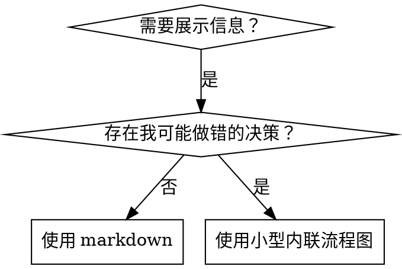

# 编写技能

## 概述

**编写技能，就是把测试驱动开发应用到流程文档。**

**个人技能位于你所使用运行时的 skills 目录中**（Claude Code 为 `~/.claude/skills/`）——Codex 或 Gemini 的路径见 [codex-tools.md](../using-superpowers/references/codex-tools.md) 和 [gemini-tools.md](../using-superpowers/references/gemini-tools.md)。Codex、Copilot CLI 和 Gemini CLI 也都识别 `~/.agents/skills/` 作为跨运行时别名。

你先编写测试用例（使用子智能体的压力场景），观察它们失败（基线行为），再编写技能（文档），观察测试通过（智能体遵从），最后重构（堵住漏洞）。

**核心原则：** 如果你没有亲眼看见智能体在没有技能的情况下失败，就不知道这个技能是否教对了东西。

**必需背景：** 使用本技能之前，你**必须**理解 superpowers:test-driven-development。该技能定义基础 RED-GREEN-REFACTOR 循环。本技能把 TDD 适配到文档编写。

**官方指南：** Anthropic 官方技能编写最佳实践见 [anthropic-best-practices.md](anthropic-best-practices.md)。该文档提供额外模式和指导，与本技能以 TDD 为中心的方法互补。

## 什么是技能？

**技能（skill）** 是经过验证的技术、模式或工具的参考指南。技能帮助未来的智能体找到并采用有效方法。

**技能是：** 可复用技术、模式、工具、参考指南

**技能不是：** 讲述你某一次如何解决问题的故事

## 技能与 TDD 的映射

| TDD 概念 | 技能创建 |
|-------------|----------------|
| **测试用例** | 通过子智能体运行的压力场景 |
| **生产代码** | 技能文档（SKILL.md） |
| **测试失败（RED）** | 没有技能时智能体违反规则（基线） |
| **测试通过（GREEN）** | 存在技能时智能体遵守规则 |
| **重构** | 在保持遵从的同时堵住漏洞 |
| **先写测试** | 编写技能前先运行基线场景 |
| **看它失败** | 记录智能体使用的精确合理化借口 |
| **最少代码** | 编写只针对这些具体违规的技能 |
| **看它通过** | 验证智能体现在会遵守规则 |
| **重构循环** | 找到新合理化 → 堵住 → 重新验证 |

整个技能创建过程遵循 RED-GREEN-REFACTOR。

## 何时创建技能

**以下情况适合创建：**
- 某种技术对你来说并不直观
- 你会在多个项目中再次引用它
- 模式广泛适用（不是项目特定）
- 其他人也能受益

**以下情况不要创建：**
- 一次性解决方案
- 已经在其他地方有完善文档的标准实践
- 项目特定约定（放在项目指令文件里）
- 机械性约束（如果可以用 regex/校验自动强制，就自动化——把文档留给需要判断的地方）

## 技能类型

### Technique（技术）
有具体步骤的方法（condition-based-waiting、root-cause-tracing）

### Pattern（模式）
思考问题的方式（flatten-with-flags、test-invariants）

### Reference（参考）
API 文档、语法指南、工具说明（office docs）

## 目录结构

```
skills/
  skill-name/
    SKILL.md              # 主参考文件（必需）
    supporting-file.*     # 仅在需要时添加
```

**扁平命名空间**——所有技能位于同一个可搜索空间中。

**单独拆文件的情况：**
1. **重型参考资料**（100+ 行）——API 文档、完整语法
2. **可复用工具**——脚本、工具程序、模板

**保持内联：**
- 原则和概念
- 代码模式（< 50 行）
- 其他所有内容

## SKILL.md 结构

**Frontmatter（YAML）：**
- 两个必填字段：`name` 和 `description`（全部受支持字段见 [agentskills.io/specification](https://agentskills.io/specification)）
- 总计最多 1024 字符
- `name`：只使用字母、数字和连字符（不要括号或特殊字符）
- `description`：第三人称，**只描述何时使用**（不要描述它做什么）
  - 以 “Use when...” 开头，聚焦触发条件
  - 包含具体症状、场景和上下文
  - **绝不要总结技能的流程或工作流**（原因见 SDO 章节）
  - 尽可能控制在 500 字符以内

```markdown
---
name: Skill-Name-With-Hyphens
description: Use when [specific triggering conditions and symptoms]
---

# Skill Name

## Overview
What is this? Core principle in 1-2 sentences.

## When to Use
[Small inline flowchart IF decision non-obvious]

Bullet list with SYMPTOMS and use cases
When NOT to use

## Core Pattern (for techniques/patterns)
Before/after code comparison

## Quick Reference
Table or bullets for scanning common operations

## Implementation
Inline code for simple patterns
Link to file for heavy reference or reusable tools

## Common Mistakes
What goes wrong + fixes

## Real-World Impact (optional)
Concrete results
```

## 技能发现优化（SDO）

**发现能力至关重要：** 未来的智能体必须能够找到你的技能。

### 1. 内容丰富的 Description 字段

**目的：** 智能体读取 description 来决定当前任务应该加载哪些技能。它必须能回答：“我现在是否应该读这个技能？”

**格式：** 以 “Use when...” 开头，聚焦触发条件。

**关键：Description = 何时使用，不是技能做什么。**

Description 只能描述触发条件。不要在 description 中总结技能的流程或工作流。

**为什么重要：** 测试发现，当 description 总结工作流时，智能体可能只遵循 description，而不读取完整技能正文。某个 description 写了“任务之间进行 code review”，结果智能体只做了**一次**审查，尽管技能流程图明确要求两阶段审查（先规格符合性，再代码质量）。

当 description 改成纯触发条件——“Use when executing implementation plans with independent tasks”（完全不总结流程）——智能体会正确读取流程图并遵循两阶段审查。

**陷阱：** 总结工作流的 description 会给智能体制造捷径，导致正文变成它会跳过的文档。

```yaml
# ❌ BAD: Summarizes workflow - agents may follow this instead of reading skill
description: Use when executing plans - dispatches subagent per task with code review between tasks

# ❌ BAD: Too much process detail
description: Use for TDD - write test first, watch it fail, write minimal code, refactor

# ✅ GOOD: Just triggering conditions, no workflow summary
description: Use when executing implementation plans with independent tasks in the current session

# ✅ GOOD: Triggering conditions only
description: Use when implementing any feature or bugfix, before writing implementation code
```

**内容要求：**
- 使用能表明该技能适用的具体触发器、症状和场景
- 描述**问题**（race conditions、行为不一致），而不是**语言特定症状**（setTimeout、sleep）
- 除非技能本身依赖技术栈，否则保持触发条件技术无关
- 如果技能确实技术特定，要明确写进触发条件
- 使用第三人称（因为它会被注入系统提示）
- **绝不要总结技能流程或工作流**

```yaml
# ❌ BAD: Too abstract, vague, doesn't include when to use
description: For async testing

# ❌ BAD: First person
description: I can help you with async tests when they're flaky

# ❌ BAD: Mentions technology but skill isn't specific to it
description: Use when tests use setTimeout/sleep and are flaky

# ✅ GOOD: Starts with "Use when", describes problem, no workflow
description: Use when tests have race conditions, timing dependencies, or pass/fail inconsistently

# ✅ GOOD: Technology-specific skill with explicit trigger
description: Use when using React Router and handling authentication redirects
```

### 2. 关键词覆盖

使用智能体可能搜索的词：
- 错误消息："Hook timed out"、"ENOTEMPTY"、"race condition"
- 症状："flaky"、"hanging"、"zombie"、"pollution"
- 同义词："timeout/hang/freeze"、"cleanup/teardown/afterEach"
- 工具：实际命令、库名、文件类型

### 3. 描述性命名

**主动语态、动词优先：**
- ✅ `creating-skills`，不要 `skill-creation`
- ✅ `condition-based-waiting`，不要 `async-test-helpers`

### 4. Token 效率（关键）

**问题：** getting-started 和经常引用的技能会加载到**每次对话**。每一个 token 都重要。

**目标字数：**
- getting-started 工作流：每个 <150 词
- 高频加载技能：总计 <200 词
- 其他技能：<500 词（仍应简洁）

**技巧：**

**把细节移到工具 help：**
```bash
# ❌ BAD: Document all flags in SKILL.md
search-conversations supports --text, --both, --after DATE, --before DATE, --limit N

# ✅ GOOD: Reference --help
search-conversations supports multiple modes and filters. Run --help for details.
```

**使用交叉引用：**
```markdown
# ❌ BAD: Repeat workflow details
When searching, dispatch subagent with template...
[20 lines of repeated instructions]

# ✅ GOOD: Reference other skill
Always use subagents (50-100x context savings). REQUIRED: Use [other-skill-name] for workflow.
```

**压缩示例：**
```markdown
# ❌ BAD: Verbose example (42 words)
your human partner: "How did we handle authentication errors in React Router before?"
You: I'll search past conversations for React Router authentication patterns.
[Dispatch subagent with search query: "React Router authentication error handling 401"]

# ✅ GOOD: Minimal example (20 words)
Partner: "How did we handle auth errors in React Router?"
You: Searching...
[Dispatch subagent → synthesis]
```

**消除冗余：**
- 不要重复交叉引用技能中已有的工作流
- 不要解释命令本身已经显而易见的内容
- 不要为同一模式放多个示例

**验证：**
```bash
wc -w skills/path/SKILL.md
# getting-started workflows: aim for <150 each
# Other frequently-loaded: aim for <200 total
```

**按你在做什么或核心洞察命名：**
- ✅ `condition-based-waiting` > `async-test-helpers`
- ✅ `using-skills`，不要 `skill-usage`
- ✅ `flatten-with-flags` > `data-structure-refactoring`
- ✅ `root-cause-tracing` > `debugging-techniques`

**动名词（-ing）特别适合流程：**
- `creating-skills`、`testing-skills`、`debugging-with-logs`
- 主动、直接描述正在进行的动作

### 5. 交叉引用其他技能

**编写引用其他技能的文档时：**

只使用技能名称，并明确标记要求：
- ✅ 好：`**REQUIRED SUB-SKILL:** Use superpowers:test-driven-development`
- ✅ 好：`**REQUIRED BACKGROUND:** You MUST understand superpowers:systematic-debugging`
- ❌ 差：`See skills/testing/test-driven-development`（不清楚是不是必须）
- ❌ 差：`@skills/testing/test-driven-development/SKILL.md`（强制加载，浪费上下文）

**为什么不用 @ 链接：** `@` 语法会立即强制加载文件，在真正需要之前就可能消耗 200k+ 上下文。

## 流程图使用方式



**流程图只用于：**
- 不明显的决策点
- 可能过早停止的流程循环
- “何时使用 A vs B” 的判断

**绝不要用流程图表示：**
- 参考资料 → 用表格、列表
- 代码示例 → 用 Markdown 代码块
- 线性指令 → 用编号列表
- 没有语义的标签（step1、helper2）

Graphviz 风格规则见本目录下的 `graphviz-conventions.dot`。

**给你的人类伙伴可视化：** 使用本目录中的 `render-graphs.js` 把技能流程图渲染成 SVG：
```bash
./render-graphs.js ../some-skill           # Each diagram separately
./render-graphs.js ../some-skill --combine # All diagrams in one SVG
```

## 代码示例

**一个优秀示例胜过多个平庸示例。**

选择最相关的语言：
- 测试技术 → TypeScript/JavaScript
- 系统调试 → Shell/Python
- 数据处理 → Python

**好示例应：**
- 完整且可运行
- 注释解释“为什么”
- 来自真实场景
- 清晰展示模式
- 可以直接适配（不是空洞模板）

**不要：**
- 同时实现 5+ 种语言
- 创建填空式模板
- 编造不真实的示例

智能体本来就很擅长移植——一个出色示例足够。

## 文件组织

### 自包含技能
```
defense-in-depth/
  SKILL.md    # Everything inline
```
适用：内容都能放下，不需要重型参考资料。

### 带可复用工具的技能
```
condition-based-waiting/
  SKILL.md    # Overview + patterns
  example.ts  # Working helpers to adapt
```
适用：工具是可复用代码，而不是单纯叙述。

### 带重型参考资料的技能
```
pptx/
  SKILL.md       # Overview + workflows
  pptxgenjs.md   # 600 lines API reference
  ooxml.md       # 500 lines XML structure
  scripts/       # Executable tools
```
适用：参考资料太大，不应全部内联。

## 铁律（与 TDD 相同）

```
没有先失败的测试，就不写技能
```

这同时适用于**新技能**和**修改现有技能**。

先写技能再测试？删除，从头开始。
修改技能却没测试？同样违规。

**没有例外：**
- “只是简单增加内容”也不行
- “只是加一节”也不行
- “只是文档更新”也不行
- 不要把未经测试的改动留下来当“参考”
- 不要一边跑测试一边“改编”
- 删除就是删除

**必需背景：** superpowers:test-driven-development 解释了为什么这件事重要。相同原则也适用于文档。

## 测试所有类型的技能

不同类型需要不同测试方式：

### 纪律强制型技能（规则/要求）

**示例：** TDD、verification-before-completion、designing-before-coding

**测试方式：**
- 学术问题：智能体是否理解规则？
- 压力场景：压力下是否仍然遵守？
- 组合多种压力：时间 + 沉没成本 + 疲劳
- 找出合理化借口，并增加明确反制

**成功标准：** 最大压力下仍遵循规则。

### 技术型技能（how-to 指南）

**示例：** condition-based-waiting、root-cause-tracing、defensive-programming

**测试方式：**
- 应用场景：是否能正确应用技术？
- 变化场景：是否能处理边界情况？
- 信息缺失测试：指令中是否存在缺口？

**成功标准：** 能把技术成功应用到新场景。

### 模式型技能（思维模型）

**示例：** reducing-complexity、information-hiding concepts

**测试方式：**
- 识别场景：能否识别模式何时适用？
- 应用场景：能否使用这个思维模型？
- 反例：是否知道何时**不**应该应用？

**成功标准：** 正确识别何时以及如何应用模式。

### 参考型技能（文档/API）

**示例：** API 文档、命令参考、库指南

**测试方式：**
- 检索场景：能否找到正确信息？
- 应用场景：能否正确使用找到的内容？
- 缺口测试：常见用例是否覆盖？

**成功标准：** 能找到并正确应用参考信息。

## 跳过测试的常见合理化借口

| 借口 | 事实 |
|--------|---------|
| “技能显然很清楚” | 对你清楚 ≠ 对其他智能体清楚。测试它。 |
| “它只是参考资料” | 参考也可能有缺口和模糊部分。测试检索。 |
| “测试太夸张了” | 未测试技能总会有问题。15 分钟测试能省数小时。 |
| “有问题时再测试” | 出问题就说明智能体已经不会用它了。部署前测试。 |
| “测试太麻烦” | 测试远比在生产中调坏技能轻松。 |
| “我很有信心” | 过度自信正是问题来源。照样测试。 |
| “学术审查已经够了” | 阅读 ≠ 使用。测试应用场景。 |
| “没时间测试” | 部署未经测试的技能，后续修复会浪费更多时间。 |

**以上所有情况都意味着：部署前测试。没有例外。**

## 让指导形式匹配失败类型

写指导之前，先分类基线失败。能把一种失败彻底堵住的形式，对另一类失败可能会可测量地适得其反。

| 基线失败 | 正确形式 | 错误形式 |
|---|---|---|
| 压力下跳过/违反规则（知道应该怎么做，但还是不做） | 禁止条款 + 合理化借口表 + red flags（见下方强化） | 软性指导（“prefer...”“consider...”） |
| 会遵守，但输出形状错误（提示过长、结论埋得太深、重述规格） | 正向 recipe / contract：明确输出**是什么**，由哪些部分组成，以及顺序 | 禁止清单（“don't restate”“never narrate”） |
| 在已经生成的产物中遗漏必需元素 | 结构化：在填写模板中增加 REQUIRED 字段或槽位 | 在模板附近写散文提醒 |
| 行为取决于某个条件 | 以可观察谓词为条件（“if the brief exists, reference it”） | 无条件规则 + 豁免条款 |

**为什么 shaping 问题中禁止条款会适得其反：** 在竞争激励（例如“让提示词自包含”）下，智能体会和“不要 X”进行协商。针对 dispatch-prompt 指导进行的正面对比措辞测试中，禁止条款组产生的不受欢迎内容明显更多，而且趋势甚至差于完全不提供指导的对照组——你应对自己的场景做微测试，而不是默认相信这一规律，但绝不要把禁止条款作为第一选择。Recipe 没有协商空间：输出要么符合规定形状，要么不符合。

**无论采用哪种形式，都遵守：**
- **不要加模糊例外。** “不要 X，除非它很重要”会重新打开协商空间——同一措辞测试中，只给胜出的 recipe 追加一个模糊例外，就让表现从稳定变得嘈杂。真实例外应写成独立的、基于可观察谓词的条件。
- **豁免条款并不能真正限定作用域。** “This limit doesn't apply to code blocks” 仍然可能抑制代码块。如果某部分输出必须豁免，应重构规则，让规则从结构上根本不会触及那部分。

## 防止智能体通过合理化绕过技能

强制纪律的技能（例如 TDD）必须能够抵抗合理化。智能体很聪明，压力下会主动寻找漏洞。

**范围：** 这套工具用于**纪律失败**——智能体知道规则，却在压力下跳过。对于输出形状错误或遗漏元素，基于禁止的“强化”反而会变差，应使用上一节“让指导形式匹配失败类型”的方法。

**心理学说明：** 理解说服技巧**为什么**有效，可以帮助你系统应用。研究基础见 [persuasion-principles.md](persuasion-principles.md)，其中介绍权威、承诺、稀缺、社会证明和一体感等原则（Cialdini, 2021; Meincke et al., 2025）。

### 明确堵住每个漏洞

不要只陈述规则——要明确禁止具体绕法：

<Bad>
```markdown
Write code before test? Delete it.
```
</Bad>

<Good>
```markdown
Write code before test? Delete it. Start over.

**No exceptions:**
- Don't keep it as "reference"
- Don't "adapt" it while writing tests
- Don't look at it
- Delete means delete
```
</Good>

### 处理“精神 vs 字面”争辩

尽早加入基础原则：

```markdown
**Violating the letter of the rules is violating the spirit of the rules.**
```

这样可以直接堵掉整类“我是在遵循精神”式合理化。

### 建立合理化借口表

从基线测试中捕获借口（见下方测试章节）。智能体提出的每个借口都放进表里：

```markdown
| Excuse | Reality |
|--------|---------|
| "Too simple to test" | Simple code breaks. Test takes 30 seconds. |
| "I'll test after" | Tests passing immediately prove nothing. |
| "Tests after achieve same goals" | Tests-after = "what does this do?" Tests-first = "what should this do?" |
```

### 建立 Red Flags 列表

让智能体在开始合理化时容易自检：

```markdown
## Red Flags - STOP and Start Over

- Code before test
- "I already manually tested it"
- "Tests after achieve the same purpose"
- "It's about spirit not ritual"
- "This is different because..."

**All of these mean: Delete code. Start over with TDD.**
```

### 在 SDO 中加入违规症状

在 description 中加入“即将违反规则”的症状：

```yaml
description: use when implementing any feature or bugfix, before writing implementation code
```

## 技能的 RED-GREEN-REFACTOR

遵循 TDD 循环：

### RED：编写失败测试（基线）

在**没有技能**的情况下，让子智能体运行压力场景。记录精确行为：
- 它选择了什么？
- 它用了哪些合理化借口（逐字）？
- 哪些压力触发了违规？

这就是“看测试失败”——你必须在写技能之前看到智能体自然会做什么。

### GREEN：编写最小技能

只编写针对这些具体合理化借口的技能。不要为假想场景加入额外内容。

用**存在技能**的相同场景重新运行。智能体现在应当遵从。

### REFACTOR：堵住漏洞

智能体找到新合理化借口？增加明确反制。反复测试，直到足够牢固。

### 在完整压力场景之前先做措辞微测试

完整压力场景是最终关卡，但每次迭代都很慢、很贵。先通过微测试验证措辞本身：

1. **每次调用使用一个全新上下文样本**——可以是原始 API 调用，或没有 API 时使用单轮子智能体。System prompt = 指导实际会所在的真实上下文（完整技能或提示词模板，而不是孤立的一句话）；user message = 会诱发目标失败的任务。
2. **始终加入无指导对照组。** 如果对照组根本不出现失败，就没有东西需要修——停止，不要写指导。
3. **每个变体至少 5 次重复。** 单个样本会骗人。
4. **人工阅读每一个命中的样本。** 可以程序化打分，但模板回显和引用反例会伪装成命中；只靠自动计数会同时高估失败和成功。
5. **把方差当作指标。** 指导真正生效时，多次重复会收敛到相同形状。5 次重复出现 5 种不同解释，说明措辞没有约束力——先收紧形式，不要继续堆字。

微测试验证措辞；对于纪律型技能，它不能取代完整压力场景。

**测试方法：** 完整测试方法见 [testing-skills-with-subagents.md](testing-skills-with-subagents.md)：
- 如何编写压力场景
- 压力类型（时间、沉没成本、权威、疲劳）
- 如何系统堵洞
- 元测试技术

## 反模式

### ❌ 叙事型示例
“在 2025-10-03 的某次会话中，我们发现空 projectDir 导致……”
**为什么差：** 太具体，不可复用。

### ❌ 多语言稀释
example-js.js、example-py.py、example-go.go
**为什么差：** 质量平庸，维护负担高。

### ❌ 在流程图中写代码
```dot
step1 [label="import fs"];
step2 [label="read file"];
```
**为什么差：** 无法复制粘贴，难读。

### ❌ 泛化标签
helper1、helper2、step3、pattern4
**为什么差：** 标签应有语义。

## 停止：进入下一个技能之前

**写完任何技能后，你都必须停止，并完整执行部署流程。**

**不要：**
- 批量创建多个技能，却不逐个测试
- 当前技能还没验证，就进入下一个
- 因为“批处理更高效”就跳过测试

**下方部署检查清单对每个技能都是强制要求。**

部署未经测试的技能 = 部署未经测试的代码。这违反质量标准。

## 技能创建检查清单（TDD 适配版）

**重要：为下面每一个检查项创建 todo。**

**RED 阶段——编写失败测试：**
- [ ] 创建压力场景（纪律型技能组合 3 种以上压力）
- [ ] 不加载技能运行场景——逐字记录基线行为
- [ ] 从合理化/失败中识别模式

**GREEN 阶段——编写最小技能：**
- [ ] 名称只使用字母、数字、连字符（无括号/特殊字符）
- [ ] YAML frontmatter 包含必需的 `name` 和 `description` 字段（最多 1024 字符；见 [spec](https://agentskills.io/specification)）
- [ ] Description 以 “Use when...” 开头，并包含具体触发器/症状
- [ ] Description 使用第三人称
- [ ] 全文包含用于搜索的关键词（错误、症状、工具）
- [ ] Overview 清晰，并写明核心原则
- [ ] 针对 RED 中识别出的具体基线失败
- [ ] 指导形式与失败类型匹配（见“让指导形式匹配失败类型”）
- [ ] 对行为塑造型指导：相对于无指导对照组做过措辞微测试（5+ 次重复，人工阅读每一个被标记的匹配）——纯参考技能不适用
- [ ] 代码内联，或链接到独立文件
- [ ] 一个优秀示例（不要多语言）
- [ ] 加载技能运行场景——验证智能体现在会遵从

**REFACTOR 阶段——堵住漏洞：**
- [ ] 从测试中识别新的合理化借口
- [ ] 增加明确反制（如果是纪律型技能）
- [ ] 根据所有测试迭代建立合理化借口表
- [ ] 创建 red flags 列表
- [ ] 反复测试直到足够牢固

**质量检查：**
- [ ] 仅当决策不明显时使用小型流程图
- [ ] 有快速参考表
- [ ] 有常见错误章节
- [ ] 没有叙事式故事
- [ ] 支持文件只用于工具或重型参考资料

**部署：**
- [ ] 把技能提交到 git，并推送到你的 fork（如果已配置）
- [ ] 如果广泛有用，考虑通过 PR 贡献回去

## 发现工作流

未来智能体如何找到你的技能：

1. **遇到问题**（“tests are flaky”）
2. **搜索技能**（grep descriptions，浏览分类）
3. **找到 SKILL**（description 匹配）
4. **扫描 overview**（是否相关？）
5. **阅读模式**（快速参考表）
6. **加载示例**（只在实现时）

**围绕这个流程优化**——把可搜索词尽早、反复出现。